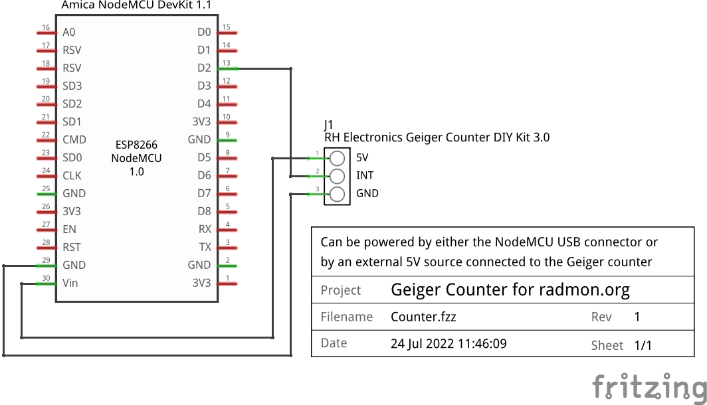

# ESP8266 Geiger Counter for radmon.org

## Overview

A simple ESP8266 Arduino sketch to count interrupts from a RH Electronics Geiger Counter DIY Kit 3.0 and periodically upload the CPM value to radmon.org  

* John DeGood jdegood@gmail.com
* July 2022

## Hardware
* RH Electronics Geiger Counter DIY Kit 3.0 with R-INT build option
* Amica NodeMCU ESP8266 module

## Pin usage
* LED_BUILTIN is GPIO2 (NodeMCU D4)
* INT_PIN is GPIO4 (NodeMCU D2)

## LED usage
* Off - counting  
* On - upload to web server in progress
* Flashing - WiFi connection attempt in progress

## Configuration
* Copy _config.h.example_ to _config.h_
* Edit _config.h_

## Arduino Tools Setting
```
Board: "NodeMCU 1.0 (ESP-12E Module)"
```
  
## Breadboard
  

## Schematic
  

## References
RH Electronics Geiger Counter DIY Kit 3.0  
https://www.rhelectronics.store/radiation-detector-geiger-counter-diy-kit-second-edition

Amica NodeMCU  
https://www.make-it.ca/nodemcu-details-specifications/  

ESP8266 WiFi  
https://github.com/esp8266/Arduino/blob/master/libraries/ESP8266WiFi/examples/WiFiClient/WiFiClient.ino  
https://github.com/esp8266/Arduino/blob/master/libraries/ESP8266HTTPClient/examples/BasicHttpClient/BasicHttpClient.ino  
